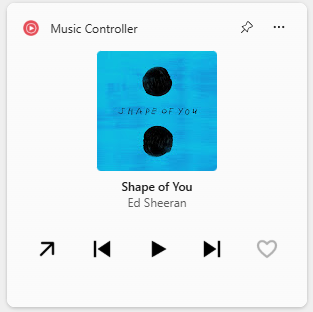
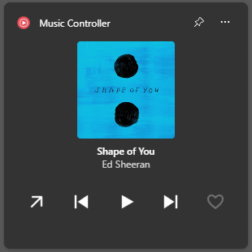

# YT Music Controller

[English](README.md) | [한국어](README_kr.md)

Chrome 또는 Edge에 설치한 **YouTube Music PWA**를 Windows 11 위젯 보드(**Win + W**)에서 제어하는 위젯입니다.

| 라이트 모드 | 다크 모드 |
| :---: | :---: |
|  |  |

- 앨범 이미지, 노래 제목, 가수 이름 표시
- 앱 열기 / 이전 곡 / 재생·일시정지 / 다음 곡 / 좋아요·취소 버튼
- Windows 밝은 테마, 어두운 테마, 고대비 테마 대응
- YouTube Music 창을 최소화한 상태에서도 동작

이 위젯은 PWA가 제공하는 Windows 미디어 세션을 읽습니다. Google 계정 정보, 브라우저 쿠키, 비밀번호는 읽지 않습니다.

## 준비물

| 항목 | 비고 |
| --- | --- |
| Windows 11 22H2 이상, x64 | 위젯 보드를 사용할 수 있어야 합니다 (Windows Web Experience Pack) |
| [.NET 10 SDK](https://dotnet.microsoft.com/download/dotnet/10.0) | `winget install Microsoft.DotNet.SDK.10` |
| [Windows SDK](https://developer.microsoft.com/windows/downloads/windows-sdk/) | `makeappx.exe`, `makepri.exe`가 포함되어 있습니다 |
| 개발자 모드 | 서명되지 않은 패키지로 위젯을 등록할 때 필요합니다 |
| YouTube Music PWA | Chrome 또는 Edge에서 설치합니다 |
| 인터넷 연결 | 첫 빌드에서 NuGet 패키지를 내려받을 때 필요합니다 |

## 설치 방법

### 1. YouTube Music PWA 설치

Chrome 또는 Edge에서 [music.youtube.com](https://music.youtube.com)을 열고, 주소창이나 브라우저 메뉴에서 **YouTube Music 설치**를 선택합니다. Google 로그인은 PWA 안에서 진행합니다.

### 2. 개발자 모드 켜기

**설정 → 시스템 → 개발자용 → 개발자 모드: 켬**

(Windows 버전에 따라 **설정 → 시스템 → 고급**에 있을 수 있습니다.)

### 3. 소스 코드 받기

```powershell
git clone https://github.com/Mossworm/music-widget.git
cd music-widget
```

GitHub에서 ZIP으로 내려받아 압축을 풀어도 됩니다. 설치 후에는 Windows가 이 폴더에서 위젯을 실행하므로, 계속 둘 위치에 저장하세요.

### 4. 빌드 및 설치

프로젝트 폴더의 PowerShell에서 다음 명령을 실행합니다.

```powershell
powershell.exe -NoProfile -ExecutionPolicy Bypass -File .\build-install.ps1
```

스크립트는 빌드, 자동 검사, `artifacts\package\` 패키징, 현재 Windows 사용자 등록을 차례로 진행합니다. 완료되면 `Installed successfully`가 표시됩니다.

스크립트는 시스템 정책을 바꾸거나 인증서를 설치하지 않습니다. `-ExecutionPolicy Bypass`는 이 명령 한 번에만 적용됩니다.

### 5. 위젯 추가

1. **Win + W**로 위젯 보드를 엽니다.
2. **+ (위젯 추가)**를 선택합니다.
3. **YT Music Controller**를 찾아 **고정**을 선택합니다.

## 사용 방법

1. YouTube Music PWA를 열고 곡을 한 번 재생합니다.
2. 위젯에 현재 곡이 표시되고 버튼이 활성화됩니다.

| 버튼 | 동작 |
| --- | --- |
| ↗ | YouTube Music을 열거나, 이미 실행 중이면 앞으로 가져옵니다 |
| ⏮ / ⏯ / ⏭ | 이전 곡, 재생·일시정지, 다음 곡 |
| ♥ | 현재 곡에 좋아요를 설정하거나 취소합니다 |

곡을 재생하기 전이나 PWA를 종료한 뒤에는 연결 안내가 표시되고 재생 버튼이 비활성화됩니다.

같은 화면의 미리보기 앱도 함께 설치됩니다. 시작 메뉴의 **YT Music Controller**를 열거나 `artifacts\package\Desktop\MusicWidget.Desktop.exe`를 실행하세요.

## 업데이트

최신 소스를 받은 뒤 같은 스크립트를 다시 실행하면 기존 설치를 교체합니다.

```powershell
git pull
powershell.exe -NoProfile -ExecutionPolicy Bypass -File .\build-install.ps1
```

## 제거

```powershell
Get-AppxPackage Mossworm.YTMusicController | Remove-AppxPackage
```

그다음 프로젝트 폴더를 삭제해도 됩니다.

## 문제 해결

| 증상 | 확인할 내용 |
| --- | --- |
| `Enable Windows Developer Mode...` | 2단계를 완료한 뒤 스크립트를 다시 실행하세요 |
| `Install the Windows SDK...` | 데스크톱 앱 도구를 포함해 Windows SDK를 설치하세요 |
| `dotnet`을 찾을 수 없음 | .NET 10 SDK를 설치하고 PowerShell 창을 새로 여세요 |
| 위젯 목록에 없음 | 위젯 보드를 닫았다 다시 열거나, 로그아웃 후 다시 로그인하세요 |
| 연결 안내에서 바뀌지 않음 | PWA에서 곡을 재생하세요. 일반 YouTube 탭과 다른 음악 앱은 지원하지 않습니다. 브라우저의 Windows 미디어 연동이 꺼져 있지 않은지 확인하세요 |
| 이전 곡 / 다음 곡이 비활성화됨 | 광고 중이거나 마지막 곡인 경우 등 YouTube Music이 허용하지 않을 수 있습니다 |
| 좋아요 버튼이 비활성화됨 | 위젯이 PWA 플레이어를 읽지 못한 상태입니다. PWA 창을 한 번 복원한 뒤 다시 시도하세요 |
| 폴더를 옮긴 뒤 동작하지 않음 | 새 위치에서 스크립트를 다시 실행하세요. 설치 후에는 `artifacts\package\`를 옮기거나 삭제하지 마세요 |

## 기타 빌드 옵션

설치 없이 빌드만 하기 (결과: `artifacts\publish\`):

```powershell
powershell.exe -NoProfile -ExecutionPolicy Bypass -File .\build-install.ps1 -BuildOnly
```

Microsoft Store 제출용 서명되지 않은 MSIX 만들기 (결과: `artifacts\msix\`):

```powershell
powershell.exe -NoProfile -ExecutionPolicy Bypass -File .\build-install.ps1 -Msix
```

제출 전에 `packaging/AppxManifest.xml`의 `Identity.Name`, `Identity.Publisher`, `PublisherDisplayName`이 Partner Center의 제품 ID 정보와 일치하는지 확인하세요.

## 동작 방식

- 곡 정보와 재생 제어에는 Windows [`GlobalSystemMediaTransportControlsSessionManager`](https://learn.microsoft.com/uwp/api/windows.media.control.globalsystemmediatransportcontrolssession) API를 사용합니다.
- Windows 미디어 세션 API에는 좋아요 기능이 없어서, Windows UI Automation으로 PWA의 좋아요 버튼을 직접 누릅니다. YouTube Music 화면 구조가 바뀌면 동작하지 않을 수 있습니다.
- PWA가 최소화된 상태에서는 좋아요 상태를 갱신하기 위해 창을 투명하게, 포커스 없이 잠깐 복원한 뒤 다시 최소화합니다.
